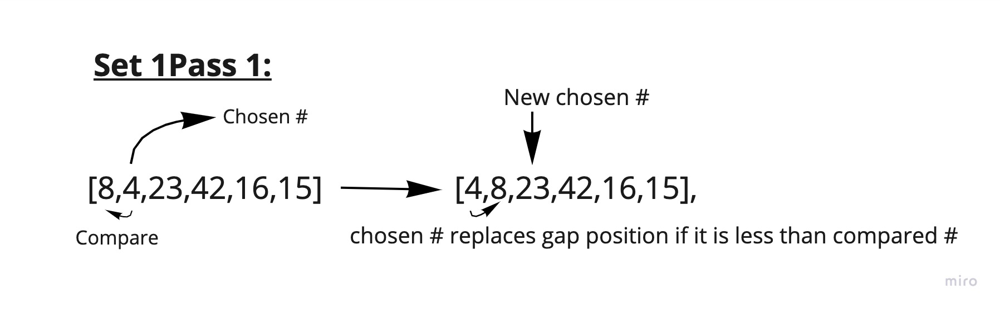
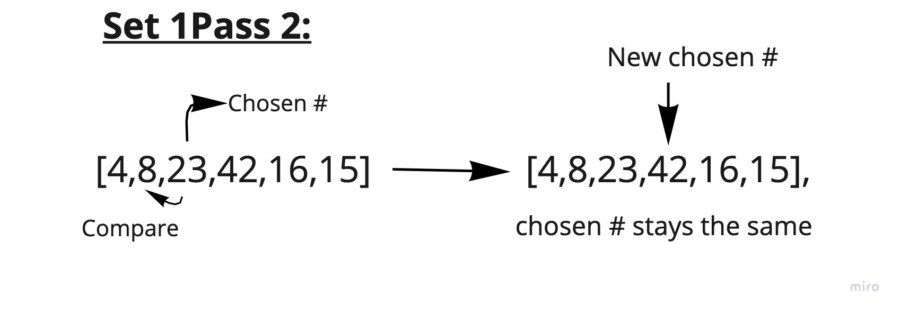
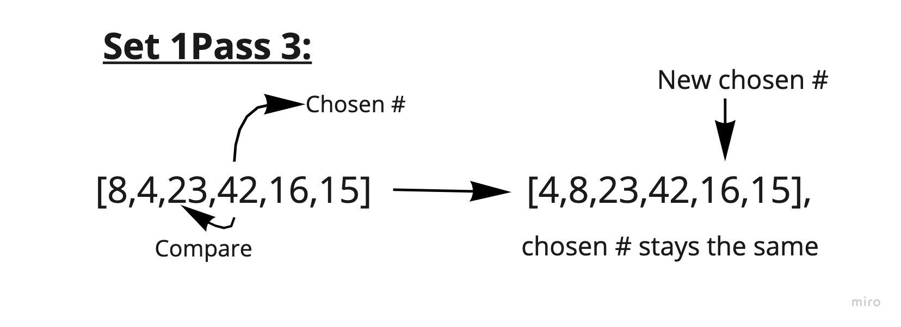
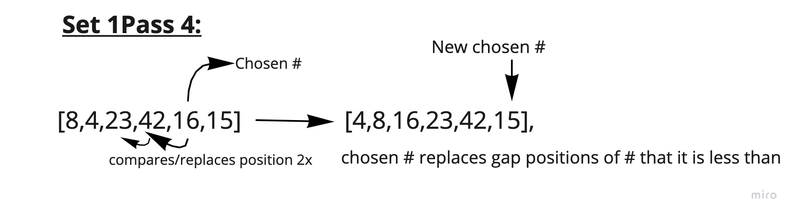
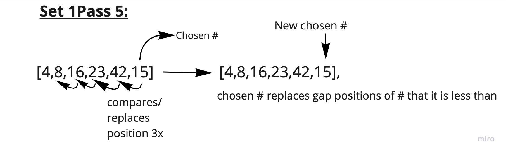

# Number Insertion Sort

Insertion sort is a sorting algorithm that has a temporary variable starting at the 2nd index of the array. The algorithm then traverses through each number on the left side of the temporary variable and swaps it with any number that it is less than. It will then declare the index to the right of the temporary variable as the new temporary variable and repeat the process until the temporary variable is at the end of the array.

## Psuedocode
```
  InsertionSort(int[] arr)

    FOR i = 1 to arr.length

      int j <-- i - 1
      int temp <-- arr[i]

      WHILE j >= 0 AND temp < arr[j]
        arr[j + 1] <-- arr[j]
        j <-- j - 1

      arr[j + 1] <-- temp
```

## Trace

Sample Array:
> [8,4,23,42,16,15]

__*Pass 1*__



In the first pass, "4" is at the second index of the list, and is the declared as the "chosen number". The function loops through everything that is on the left side of the chosen number, and if it is less than them, will replace their position in the list, and the compared number will be moved to the right. The number to the right of the chosen number's previous position is then declared as the new chosen number

__*Pass 2*__



The function repeats the process and in this case, the chosen number is greater than all of the numbers to the left of it so it remains in the same position. The number to the right of the chosen number's previous position is then declared as the new chosen number

__*Pass 3*__



The function repeats the process and in this case, the chosen number is greater than all of the numbers to the left of it so it remains in the same position. The number to the right of the chosen number's previous position is then declared as the new chosen number

__*Pass 4*__



The chosen number is less than the previous 2 numbers in the list, so the chosen number takes the spot of the first number it was compared to, and on the next loop through, takes the spot of the second number it was compared to. Both compared numbers move to the right by one position. The number to the right of the chosen number's previous position is then declared as the new chosen number

__*Pass 5*__



The chosen number is less than the previous 4 numbers in the list, so the chosen number takes the spot of the first through fourth number it was compared to, and by the end of all of those loops, takes the spot of the last number it was compared to. All compared numbers move to the right by one position. The loop ends as there is no more numbers that can become the chosen number

## Efficiency

Time - O(n

Space O(1)
